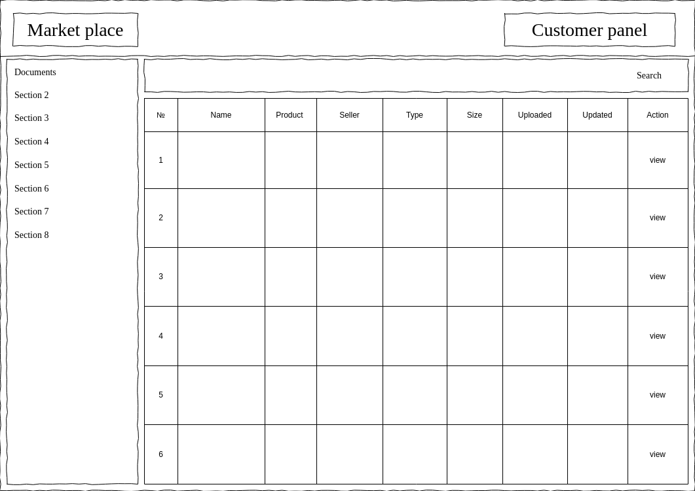
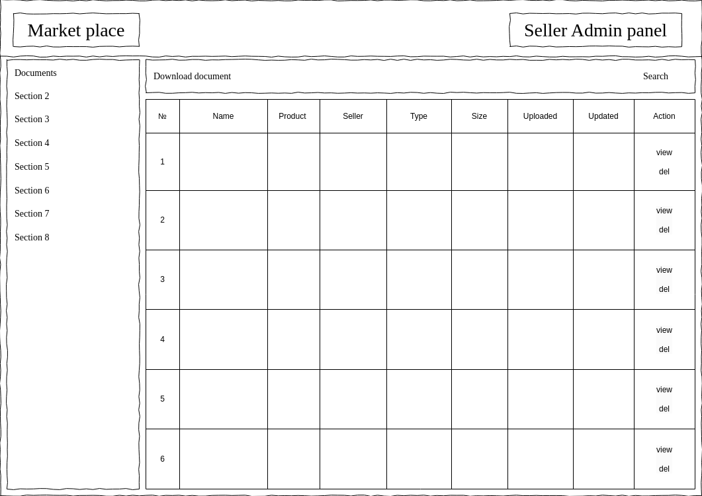
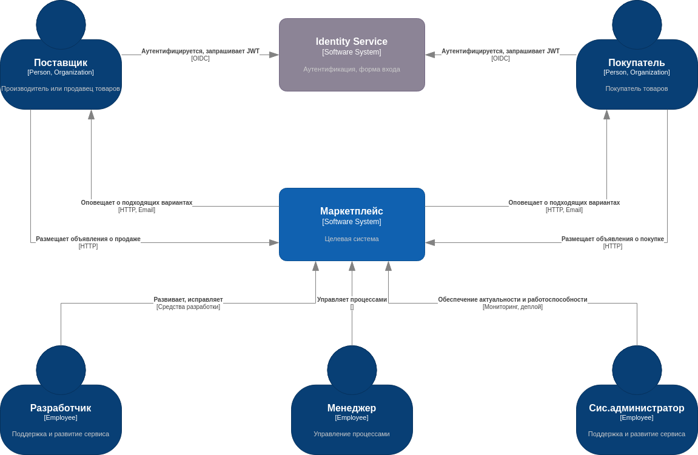
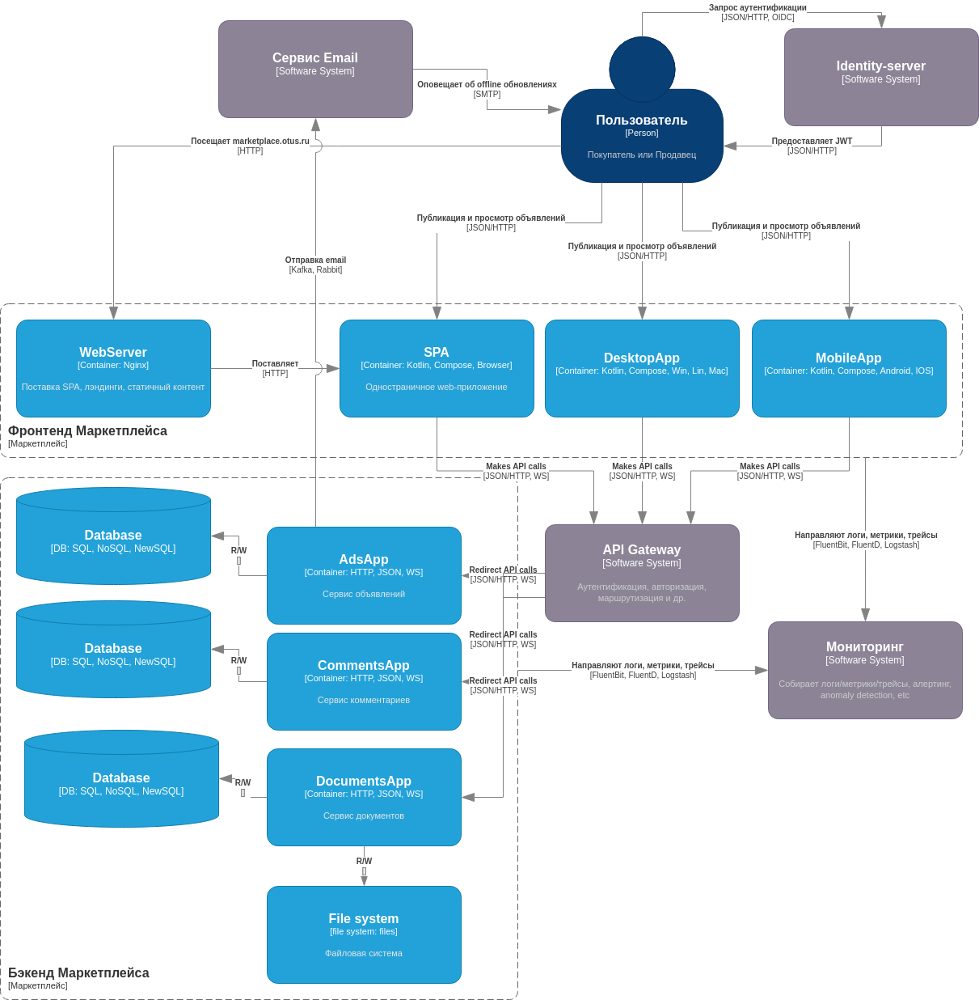
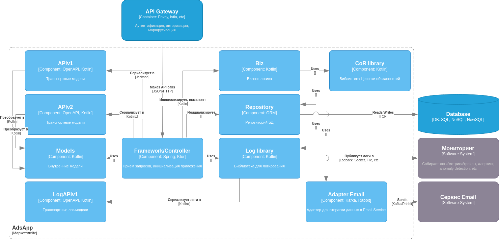
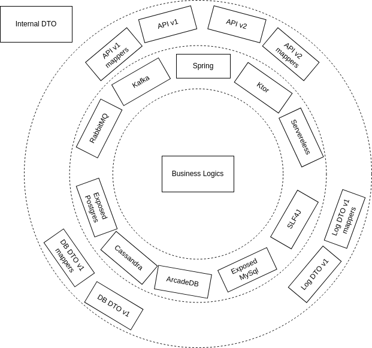
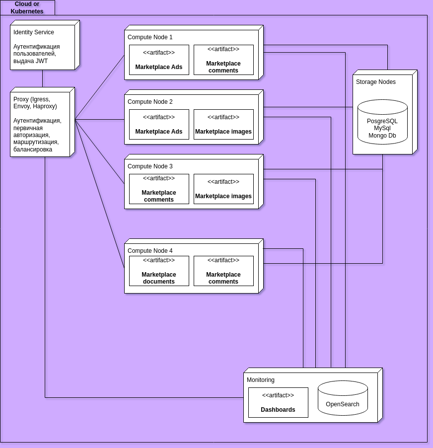
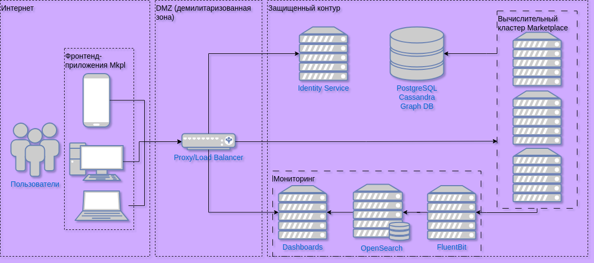

[Ru](README.md)
# Documents Microservice
### Project Description

**Documents** is a microservice designed to handle the storage, retrieval, and referencing of documents.
It is a backend service that supports the upload, management, and access of various documents
by creating references to each stored document.

# ADR: Document Management for Sellers and Buyers

## Context and Problem Statement
Sellers must be able to upload, search, update, and delete documents.
Buyers must be able to search, download, and view documents.
It is necessary to determine the most effective document management mechanism for both sellers and buyers.

## List of Business Requirements Addressed
- **User Story 1: Document Management**

## List of Possible Solutions
1. Create a document management panel for sellers and buyers on the platform.
2. Integrate with external cloud storage services. Introduce the ability to store documents on external platforms, such as AWS S3, Google Cloud Storage, or similar services.

## Decision Taken
Decision 1 was selected: Create a document management panel for sellers and buyers on the platform.

## Rationale for Decision
This option was chosen because the document management panel will provide an intuitive interface for 
sellers and buyers, allowing them to easily upload, update, view, and download documents. 
Both types of users will be able to interact with the system directly without needing to learn third-party services
or deal with complex integrations. By managing documents within the company's own platform, 
full control over document management processes can be ensured. This allows for flexible access levels 
to be set for sellers and buyers, as well as the implementation of necessary security measures such as 
access control, without relying on external services.

### Target Audience

This microservice is intended for:

- **Sellers**: Sellers need a document management system for internal operations, and can independently manage documents
  related to their products, services, and warranty rules.
- **Customers**: Customers who need documents to obtain useful information about products, services and warranty
  conditions.

### Audience Portraits

- **Sellers**:
    - **Gender**: Male/Female
    - **Age**: 30-55 years old
    - **Location**: Major cities in Russia or small towns with an active market for selling goods and services
    - **Professional experience**: Small or medium-sized businesses, individual entrepreneurs, self-employed individuals
      who regularly sell goods or provide services
    - **Income**: Average or above average (from 70,000 rubles per month)
    - **Hobbies**: Entrepreneurship, business development, technology, travel, cars
    - **Why this user will come to you**: Sellers want to effectively manage documents related to sales (contracts,
      acts, invoices). The service helps to easily upload, store, and provide supporting documents to buyers, which
      enhances trust in transactions and helps avoid potential disputes.

- **Customers**:
    - **Gender**: Male/Female
    - **Age**: 25-45 years old
    - **Location**: Major cities in Russia (Moscow, Saint Petersburg, Novosibirsk) or provincial areas with internet
      access
    - **Professional experience**: Mid-level professionals or office workers who regularly shop online
    - **Income**: Medium income (50-100 thousand rubles per month)
    - **Hobbies**: Online shopping, cars, technology, hobbies (DIY, sports, gadgets)
    - **Why this user will come to you**: Users want to buy goods or services quickly and securely through ads and
      receive supporting documents (receipts, invoices, contracts). The service simplifies storage and access to these
      documents, which is crucial for tracking expenses and ensuring the safety of transactions.

### MVP Description

The **Minimum Viable Product (MVP)** of this microservice focuses on enabling
sellers to:

1. Upload documents.
2. Retrieve documents via their reference ID.
3. Delete documents from the storage.
4. Update metadata associated with documents.

customers to:

1. Retrieve documents via their reference ID.

### Frontend Sketch

Customer panel:

Seller panel:

---

## API

#### 1. **Document Entity** (document)

- **Attributes**:
    - `id` (Long): Unique identifier for the document.
    - `name` (String): The document’s original name.
    - `productId` (Long): A unique reference identifier for accessing the document. (product)
    - `sellerId` (Long): A identifier of seller who upload the document. (seller)
    - `type` (String): The document’s MIME type (e.g., `application/pdf`, `image/png`).
    - `size` (Long): Size of the document in bytes.
    - `uploadDate` (LocalDateTime): Timestamp for when the document was uploaded.
    - `updateDate` (LocalDateTime): Timestamp for when the document was updated.
    - `filePath` (String): The path where the document is stored.

## Endpoints

1. CRUDS (create, read, update, delete, search) for documents (document)

---

### Architecture

## Context diagram C4

---

## Container diagram C4

---

## Component diagram C4

---

## Onion component diagram

---

### Devops

---

## Network diagram
